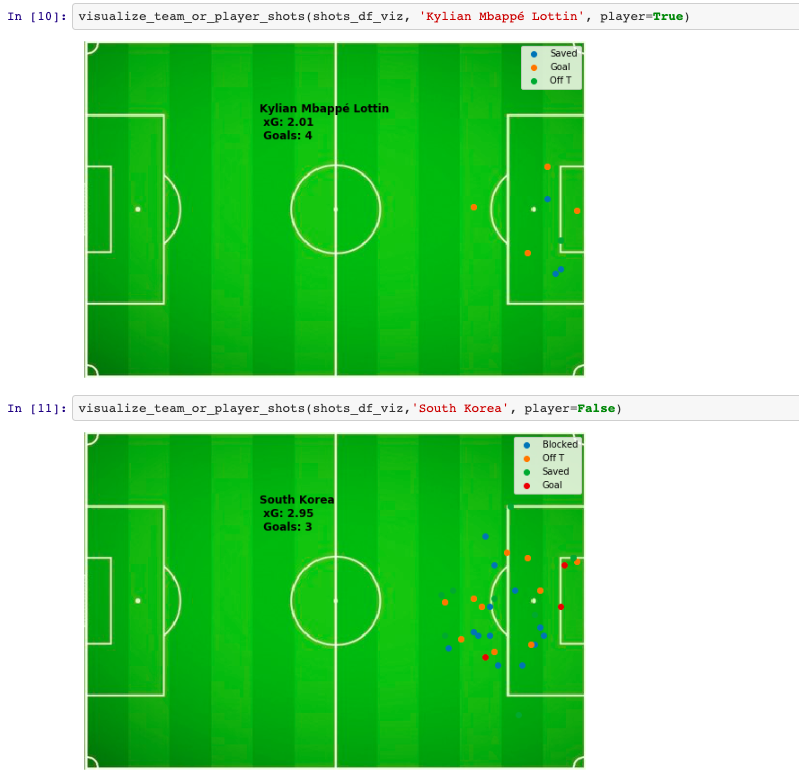

# Notebooks for World Cup 2018 (via Statsbomb)

| Directory               | Description                                                                      |
| ------------------------------|--------------------------------------------------------------------------- |
| **how_to_create_shot_charts** | notebook for making shot charts for any player or team                     |
| **how_to_create_shot_df**     | notebook for easily parsing shot data from statsbomb world cup jsons       |

The code for creating shot_charts can be found in `scripts/shot_charts.py` while the code for
processing the statsbomb JSONs can be found in `scripts/event_helpers.py`.

